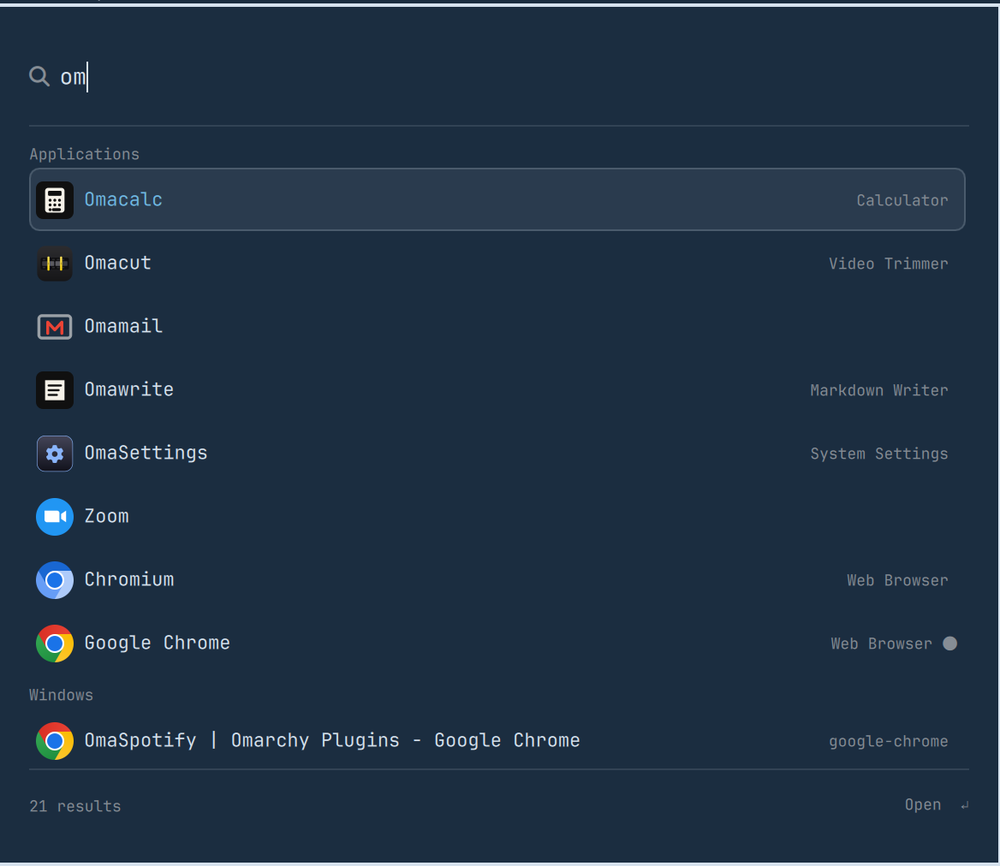

# OmaCast

A command palette for Omarchy. One keystroke, one card, and it answers with
apps, windows, menu actions, keybindings, maths, quicklinks, snippets,
clipboard history, emoji and files.



It runs inside the existing `omarchy-shell` process, so there is no daemon and
no second Quickshell.

## Install

```bash
omarchy plugin add https://github.com/TerrifiedBug/omacast.git --enable
```

Then bind a key in `~/.config/hypr/bindings.lua`:

```lua
o.bind("ALT + SPACE", "OmaCast", "omarchy-shell shell toggle io.github.terrifiedbug.omacast '{}'")
```

`ALT + SPACE` is free in stock Omarchy, so `SUPER + SPACE` stays the Omarchy
menu. Run `hyprctl reload` after editing the file.

You can also open it straight into a scope, or with the field prefilled:

```lua
o.bind("SUPER + SHIFT + V", "Clipboard", "omarchy-shell shell toggle io.github.terrifiedbug.omacast '{\"scope\":\"clipboard\"}'")
o.bind("SUPER + SHIFT + G", "GitHub search", "omarchy-shell shell toggle io.github.terrifiedbug.omacast '{\"query\":\"gh \"}'")
```

Hyprland animates the layer on open. To make it pop like the stock menu, add
this to `~/.config/hypr/hyprland.lua`:

```lua
hl.layer_rule({ match = { namespace = "omarchy-omacast" }, no_anim = true, animation = "none" })
```

## Remove

```bash
omarchy plugin remove io.github.terrifiedbug.omacast
```

Then drop the `o.bind("ALT + SPACE", "OmaCast", …)` line from
`~/.config/hypr/bindings.lua` and run `hyprctl reload`. Two files are left
behind if you want them gone:

```bash
rm ~/.local/state/omarchy/omacast-state.json   # pins and usage counts
rm ~/.config/omarchy/omacast.json               # your config, if you created one
```

## What it answers

| Type this | You get |
|---|---|
| `chrom` | Applications, ranked the way the Omarchy launcher ranks them, with a dot on the ones already running |
| `lock`, `screenshot`, `theme` | Omarchy menu actions from anywhere in the tree, with their breadcrumb |
| `full screen` | Your Hyprland keybindings, run straight from the palette |
| `12*7+3`, `20% of 250`, `2^10`, `255 to hex` | An answer row. Enter copies it |
| `10 km to miles`, `72f in c`, `5 GiB to MB` | Unit conversion |
| `gh quickshell` | A quicklink, opened in your browser |
| `cb ssh` | Clipboard history, pasted or copied |
| `:smile` | Emoji, typed into the focused window |
| `f invoice`, `~/coding/` | File search through `fd`, opened with `gio` |
| `win chrome` | Open windows, the full list, with switch and close |
| `github.com/omacom` | The link, opened |
| anything else | A web search with your engine |
| `?` | The cheat sheet: every prefix and keyword you have configured |

An empty field shows your pinned rows, then what you use most, then your open
windows. Ranking is the launcher's own tier order plus a small bonus for what
you launch often, capped so the exact name of a rarely used app still wins.

## Keys

| Key | Action |
|---|---|
| `↑` `↓`, `Ctrl+P` `Ctrl+N` | Move the cursor |
| `PgUp` `PgDn` | Move six rows |
| `Enter` | Primary action, named in the footer |
| `Ctrl+Enter`, `Shift+Enter` | Secondary action, also named in the footer |
| `Ctrl+1` … `Ctrl+9` | Run the nth row |
| `Tab` | Complete the row's keyword or name into the field |
| `Ctrl+.` | Pin or unpin the selected row |
| `Ctrl+U` | Clear the field |
| `Backspace` on an empty field | Leave the current scope |
| `Esc` | Clear the confirmation, then the field, then the scope, then close |

Destructive menu rows (shutdown, reboot, logout, hibernate, suspend and every
`Remove` row) need Enter twice. The footer says so while the first press is
armed.

## Configuration

Config lives in `~/.config/omarchy/omacast.json` and does not exist until you
want it. Search the palette for `config` and press Enter: that row copies
`omacast.example.json` into place and opens it in your editor. The example
changes nothing on its own, it just documents the keys.

Comments and trailing commas are fine, like Omarchy's own menu JSONC. Saving
applies immediately, with no restart.

```json
{
  "searchEngine": "ddg",
  "quicklinks": [
    { "name": "Work GitHub", "keyword": "wgh", "url": "https://github.com/my-org/{argument}" },
    { "name": "Jira", "keyword": "j", "url": "https://jira.example.com/browse/{argument | uppercase}" }
  ],
  "snippets": [
    { "name": "Signature", "keyword": "sig", "text": "Cheers,\nDanny" },
    { "name": "Today", "keyword": "td", "text": "{date format=\"yyyy-MM-dd\"}" }
  ],
  "commands": [
    { "name": "Rebuild site", "keyword": "rb", "command": "make -C ~/site build", "terminal": true },
    { "name": "Prune docker", "command": "docker system prune -f", "confirm": true }
  ]
}
```

`searchEngine` is the keyword of the quicklink used for the web fallback, `g` by
default. Built-ins are `g`, `ddg`, `yt`, `gh`, `aw`, `aur` and `w`. They live in
the plugin, so an update can fix a search URL without touching your file, and
your own quicklink with the same keyword wins. Hide one with
`{ "hiddenQuicklinks": ["ddg", "aur"] }`, or set `"builtinQuicklinks": false` to
start from nothing, which drops the web fallback row too.

Quicklinks, snippets and commands take the same tokens: `{argument}`,
`{clipboard}`, `{selection}`, `{date}`, `{time}`, `{datetime}`, `{day}` and
`{uuid}`. `{date}` and friends take a `format` attribute built from
`yyyy MM dd HH mm ss`. Pipe modifiers are `trim`, `uppercase`, `lowercase`,
`percent-encode` and `raw`. Values in a URL are percent-encoded unless you ask
for `raw`.

Command arguments are passed as positional parameters, so `rb --clean` runs
`make -C ~/site build "--clean"` without a shell re-parsing what you typed.

## State

Pins and usage counts live in `~/.local/state/omarchy/omacast-state.json`. It
keeps at most 400 keys, decayed by age, and stores nothing about what you
searched. Delete it to start over:

```bash
rm ~/.local/state/omarchy/omacast-state.json && omarchy-restart-shell
```

## Dependencies

Everything here ships with Omarchy.

| Tool | Used for |
|---|---|
| `fd` | File search |
| `gio` (glib2) | Opening files and folders |
| `wtype`, `wl-clipboard` | Pasting clipboard entries, snippets and emoji |
| `jq` | Used by the stock clipboard helpers OmaCast calls |
| `bash` | Menu actions, guards, keybinding dispatch |

Nothing leaves your machine except the URLs you activate, when they open in your
browser. Apps come from your desktop entries, actions from the menu JSONC,
clipboard from the stock history file, files from `fd` on your own disk.

## What it reuses from Omarchy

`shell/services/AppLibrary.qml` is loaded at runtime for the app list, its icon
index, hidden-entry filtering and launch feedback. `shell/plugins/menu/MenuModel.js`
is vendored in `vendor/` to parse the menu JSONC and build the same `when:` and
`checked:` guard batch the menu runs. Both are MIT, see `NOTICE`. Sharing them
keeps the palette in agreement with the rest of the desktop about what your apps
and menu actions are.

Verified against Omarchy 4.0.3 with Quickshell 0.3.1.

## Development

```bash
omarchy plugin add "file://$PWD" --enable --yes
node --test test/
```

`Model.js` holds the logic and has no Qt in it, which is why the tests can load
it directly. `Sources.qml` owns every process, file watch and timer.
`Omacast.qml` draws the card and owns the keys.

Two IPC methods help when you are working on it:

```bash
omarchy-shell shell call io.github.terrifiedbug.omacast setQuery '10 km to miles'
omarchy-shell shell call io.github.terrifiedbug.omacast inspect '{}' | jq
```

## License

MIT. See `LICENSE` and `NOTICE`.
