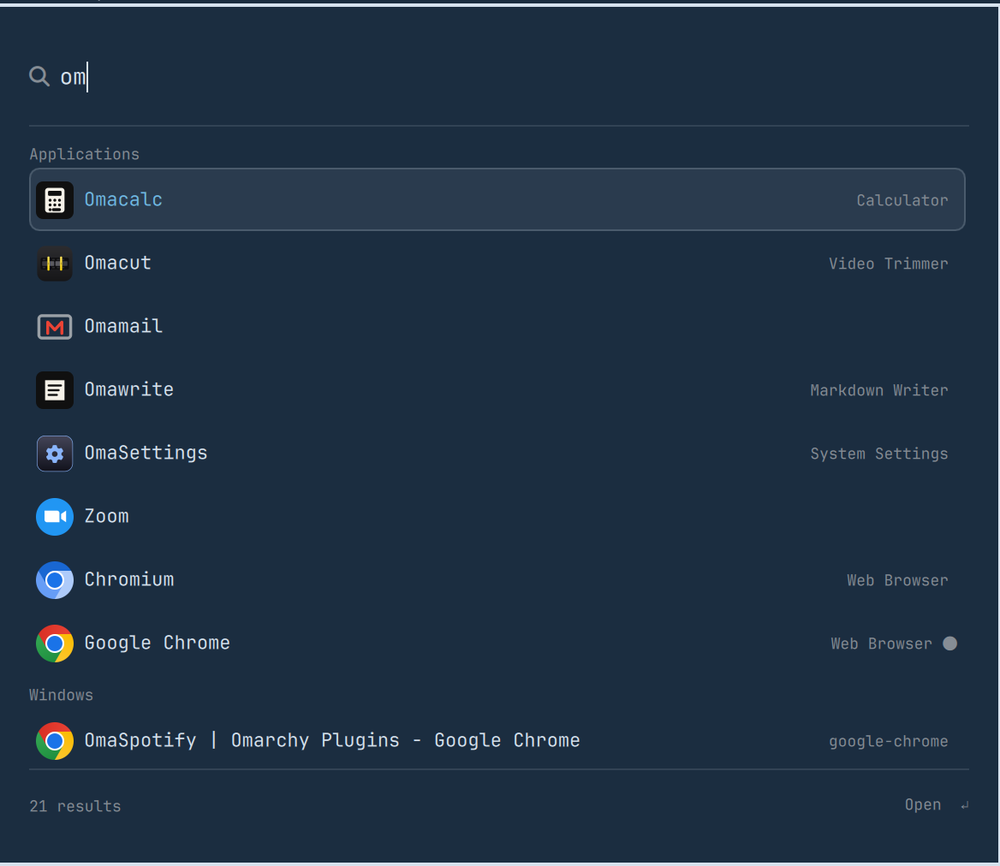

# OmaCast

A command palette for Omarchy. One keystroke, one card, and it answers with
apps, windows, menu actions, keybindings, maths, dates, colours, quicklinks,
snippets, script commands, clipboard history, emoji and files.



It runs inside the existing `omarchy-shell` process, so there is no daemon and
no second Quickshell.

## Install

```bash
omarchy plugin add https://github.com/TerrifiedBug/omacast.git --enable
```

Open Settings to bind the palette key:

```bash
omarchy-shell shell summon io.github.terrifiedbug.omacast '{"scope":"settings"}'
```

Select **Open palette**, press Enter, type a chord and press Enter to save.
The suggested `ALT + SPACE` is free in stock Omarchy; `SUPER + SPACE` keeps
opening the Omarchy menu.

You can also open it straight into a scope, or with the field prefilled:

```lua
o.bind("SUPER + SHIFT + V", "Clipboard", "omarchy-shell shell toggle io.github.terrifiedbug.omacast '{\"scope\":\"clipboard\"}'")
o.bind("SUPER + SHIFT + G", "GitHub search", "omarchy-shell shell toggle io.github.terrifiedbug.omacast '{\"query\":\"gh \"}'")
```

Hyprland animates the layer on open. To make it pop like the stock menu, add
this to `~/.config/hypr/hyprland.lua`:

```lua
hl.layer_rule({ match = { namespace = "omarchy-omacast" }, no_anim = true, animation = "none" })
```

### Bar button

Turn **Bar button** on in Settings. Enabling the plugin gives it a slot on the
right, with the button hidden by default. The CLI works too:

```bash
omarchy bar set io.github.terrifiedbug.omacast button true
omarchy bar move io.github.terrifiedbug.omacast left   # or center, right
```

An install from before the button existed has no bar slot. Run
`omarchy plugin disable io.github.terrifiedbug.omacast` and then
`omarchy plugin enable io.github.terrifiedbug.omacast right` to give it one.

## Remove

```bash
omarchy plugin remove io.github.terrifiedbug.omacast
```

Before removing the plugin, use Settings to unbind the palette key and turn
off its clipboard shortcut. You can also remove the whole block between
`-- omacast: begin.` and `-- omacast: end.` in `~/.config/hypr/bindings.lua`,
then run `hyprctl reload`. Remove any hand-written OmaCast bindings too.
A few files are left behind if you want them gone:

```bash
rm ~/.local/state/omarchy/omacast-state.json   # pins, hidden rows, usage counts, last query
rm ~/.config/omarchy/omacast.json               # your config, if you created one
rm -r ~/.config/omarchy/omacast                 # your script commands, if you added any
rm ~/.cache/omarchy/omacast-rates.xml           # currency rates, if you turned them on
```

## What it answers

| Type this | You get |
|---|---|
| `chrom` | Applications, ranked the way the Omarchy launcher ranks them, with a dot on the ones already running. Enter focuses a running app, Ctrl+Enter starts another |
| `fierfox` | One typo is forgiven on words of four letters or more, below every correctly spelled match |
| `lock`, `screenshot`, `theme` | Omarchy menu actions from anywhere in the tree, with their breadcrumb |
| `bg next`, `restart wifi` | Every `omarchy` command that takes no arguments and no sudo, unless the menu already has it |
| `lumon`, `theme cat` | Your installed themes, with a tick on the current one. Enter applies it |
| `full screen` | Your Hyprland keybindings, run straight from the palette |
| `12*7+3`, `20% of 250`, `2^10`, `255 to hex` | An answer row. Enter copies it |
| `10 km to miles`, `72f in c`, `5 GiB to MB` | Unit conversion |
| `days until dec 25`, `today + 90 days`, `friday`, `now`, `1790000000` | Date maths, the next weekday, unix time both ways |
| `3pm ist in pst`, `now in tokyo`, `time in berlin, new york` | Time zones, answered by `date` |
| `#ff8800`, `rgb(255,136,0)`, `hsl(30,100%,50%)` | The colour as HEX, RGB and HSL, with a swatch |
| `remind 30 check the oven`, `remind me at 17:30 to leave` | A reminder through `omarchy reminder` |
| `gh quickshell` | A quicklink, opened in your browser |
| `cb ssh` | Clipboard history, pasted or copied |
| `:smile` | Emoji, typed into the focused window |
| `f invoice`, `~/coding/` | File search through `fd`, opened with `gio` |
| `#TODO` | Files whose contents match, through `rg` |
| `win chrome` | Open windows, the full list, with switch and close |
| `kill firefox` | Your own processes by CPU use. Enter twice terminates, Ctrl+Enter twice kills |
| `jira ABC-1` | A script command you dropped in the scripts folder |
| `100 usd to eur` | Currency, if you turned it on |
| `ask how do tides work` | Your coding agent, if you turned it on |
| `github.com/omacom` | The link, opened |
| anything else | A web search with your engine |
| `?` | The cheat sheet: every prefix and keyword you have configured |

An empty field shows your pinned rows, then what you use most, then your open
windows. Ranking is the launcher's own tier order plus a small bonus for what
you launch often, capped so the exact name of a rarely used app still wins.

On a screen at least 1400 px wide, a preview pane opens beside the list when
the selected row has something to show: the head of a text file, an image, the
matching lines of a content search, the full clipboard entry, a snippet with
today's date filled in, or the command a row runs.

## Keys

| Key | Action |
|---|---|
| `↑` `↓`, `Ctrl+P` `Ctrl+N` | Move the cursor |
| `Ctrl+↑` `Ctrl+↓` | Jump to the previous or next section |
| `↑` in an empty field | Bring back the last query |
| `PgUp` `PgDn` | Move six rows |
| `Enter` | Primary action, named in the footer |
| `Ctrl+Enter`, `Shift+Enter` | Secondary action, also named in the footer |
| `Ctrl+K` | Every action for the selected row: copy a path, open a terminal there, delete a clipboard entry, reset its ranking, hide an app, and so on |
| `Ctrl+1` … `Ctrl+9` | Run the nth row. Hold Ctrl for a moment to see the numbers |
| `Tab` | Complete the row's keyword or name into the field |
| `Ctrl+.` | Pin or unpin the selected row |
| `Ctrl+U` | Clear the field |
| `Backspace` on an empty field | Leave the current scope |
| `Esc` | Close the actions panel, then clear the confirmation, the field, the scope, and finally close |

Destructive rows (shutdown, reboot, logout, hibernate, suspend, every `Remove`
row, `omarchy` commands that remove, reinstall or refresh things, and every
process) need Enter twice. The footer says so while the first press is armed.

A hidden app stays out of results and the empty palette. Type `?` and pick
Show hidden to bring it back.

## Configuration

Search the palette for `settings` and press Enter. General covers the search
engine, preview pane, currency rates, Ask agent and bar button. Shortcuts
sets the palette key and the `SUPER + CTRL + V` clipboard override. Library
holds quicklinks, snippets, commands, built-in quicklinks and script folders.

Use the usual arrows and Enter to browse. Enter toggles an On/Off row or
opens a text field in the search input, with its value selected. Enter saves;
Esc cancels. Esc or Backspace in an empty search field returns to the parent
scope. An entry's Delete row needs Enter twice. Ctrl+Enter runs a secondary
action, such as removing a script folder or unbinding the palette key.

Snippet text uses `\n` for a newline and `\\` for a literal backslash in the
single-line editor. Reopening the field shows those escapes again.

Settings writes `~/.config/omarchy/omacast.json` as plain, indented JSON on
each save. It creates the file when needed, drops comments and keeps unknown
top-level keys. You can still edit the file by hand: comments and trailing
commas are accepted, and saving applies immediately without a restart.
Advanced's **Edit config file** row opens your editor and creates the file
from `omacast.example.json` if it doesn't exist.

Shortcut settings own a marked block at the end of
`~/.config/hypr/bindings.lua`. Toggle the clipboard override off to restore
Omarchy's clipboard manager, or use Unbind on the palette key. Removing the
whole marked block undoes both. OmaCast reloads Hyprland after a change and
restores the previous file if Hyprland reports a config error. Existing
hand-written OmaCast bindings outside the block need removing by hand.

```json
{
  "searchEngine": "ddg",
  "quicklinks": [
    { "name": "Work GitHub", "keyword": "wgh", "url": "https://github.com/my-org/{argument}" },
    { "name": "Jira", "keyword": "j", "url": "https://jira.example.com/browse/{argument | uppercase}" }
  ],
  "snippets": [
    { "name": "Signature", "keyword": "sig", "text": "Cheers,\nDanny" },
    { "name": "Today", "keyword": "td", "text": "{date format=\"yyyy-MM-dd\"}" }
  ],
  "commands": [
    { "name": "Rebuild site", "keyword": "rb", "command": "make -C ~/site build", "terminal": true },
    { "name": "Prune docker", "command": "docker system prune -f", "confirm": true }
  ],
  "scriptDirs": ["~/dotfiles/raycast"],
  "preview": true,
  "currency": false,
  "ai": false
}
```

`searchEngine` is the keyword of the quicklink used for the web fallback, `g` by
default. Built-ins are `g`, `ddg`, `yt`, `gh`, `aw`, `aur` and `w`. They live in
the plugin, so an update can fix a search URL without touching your file, and
your own quicklink with the same keyword wins. Hide one with
`{ "hiddenQuicklinks": ["ddg", "aur"] }`, or set `"builtinQuicklinks": false` to
start from nothing, which drops the web fallback row too.

Quicklinks, snippets and commands take the same tokens: `{argument}`,
`{clipboard}`, `{selection}`, `{date}`, `{time}`, `{datetime}`, `{day}` and
`{uuid}`. `{date}` and friends take a `format` attribute built from
`yyyy MM dd HH mm ss`. Pipe modifiers are `trim`, `uppercase`, `lowercase`,
`percent-encode` and `raw`. Values in a URL are percent-encoded unless you ask
for `raw`.

Command arguments are passed as positional parameters, so `rb --clean` runs
`make -C ~/site build "--clean"` without a shell re-parsing what you typed.

`preview` switches the preview pane off. `currency` and `ai` are off until you
turn them on; see Privacy below for what they do.

## Script commands

Drop an executable script into `~/.config/omarchy/omacast/scripts/` (search the
palette for `scripts` to open or create the folder) and it becomes a row.
OmaCast reads Raycast's script command header, so the scripts in
[raycast/script-commands](https://github.com/raycast/script-commands) work
unchanged as long as they don't depend on macOS:

```bash
#!/bin/bash
# @raycast.schemaVersion 1
# @raycast.title Search Jira
# @raycast.mode silent
# @raycast.argument1 { "type": "text", "placeholder": "issue" }
# @raycast.needsConfirmation false
xdg-open "https://jira.example.com/browse/$1"
```

The file name is the keyword, so `jira.sh` answers `jira ABC-1`. Up to three
arguments follow the keyword, split on spaces, with `"double quotes"` keeping
spaces together. A row whose required argument is missing shows `Needs issue`
and doesn't run. The header can also use `//` comments (JavaScript) or `--`
comments (Lua).

| Mode | What happens |
|---|---|
| `silent` | Runs in the background |
| `compact` | Runs for up to 10 seconds, then the last line it printed shows as a notification |
| `fullOutput` | Runs in a floating terminal |
| `inline` | Runs each time the palette opens, or every `refreshTime` (`30s`, `5m`, `1h`), and its first line becomes the row's subtitle. Enter runs it again |

A script without the executable bit is listed as `not executable` and never
runs. Output is capped at 64 KB. `@raycast.icon` is used when it is an emoji and
ignored otherwise. More folders go in `scriptDirs`.

## State

Pins, hidden rows, usage counts and the last query you typed live in
`~/.local/state/omarchy/omacast-state.json`. It keeps at most 400 usage keys,
decayed by age. The last query is the only search it stores, and only so `↑`
can bring it back. Delete the file to start over:

```bash
rm ~/.local/state/omarchy/omacast-state.json && omarchy-restart-shell
```

## Privacy

Nothing leaves your machine except the URLs you activate, when they open in your
browser. Apps come from your desktop entries, actions from the menu JSONC,
commands from `omarchy commands`, clipboard from the stock history file, files
from `fd` and `rg` on your own disk.

Two opt-in settings change that:

- `"currency": true` downloads
  `https://www.ecb.europa.eu/stats/eurofxref/eurofxref-daily.xml` to
  `~/.cache/omarchy/omacast-rates.xml`, at most once a day and only when the
  palette opens. That is the only request OmaCast makes itself.
- `"ai": true` adds an `Ask <agent>` row for queries of three or more words, or
  anything starting with `ask `. Enter runs `omarchy agent prompt` with your
  query, so it goes wherever your default agent sends it. OmaCast makes no
  request of its own.

## Dependencies

Everything here ships with Omarchy.

| Tool | Used for |
|---|---|
| `fd` | File search |
| `rg` (ripgrep) | Content search and its preview |
| `gio`, `gdbus` (glib2) | Opening files and folders, revealing a file in the file manager |
| `wtype`, `wl-clipboard` | Pasting clipboard entries, snippets and emoji |
| `jq` | Used by the stock clipboard helpers OmaCast calls |
| `ps`, `kill` (procps) | The `kill ` scope |
| `date` (coreutils) | Time zone answers |
| `curl` | Currency rates, only when turned on |
| `bash` | Menu actions, guards, keybinding dispatch, scripts |

## What it reuses from Omarchy

`shell/services/AppLibrary.qml` is loaded at runtime for the app list, its icon
index, hidden-entry filtering and launch feedback. `shell/plugins/menu/MenuModel.js`
is vendored in `vendor/` to parse the menu JSONC and build the same `when:` and
`checked:` guard batch the menu runs. Both are MIT, see `NOTICE`. Sharing them
keeps the palette in agreement with the rest of the desktop about what your apps
and menu actions are.

Verified against Omarchy 4.0.3 with Quickshell 0.3.1.

## Design choices

OmaCast is an overlay on its own key and leaves the stock menu alone. Keystroke,
Omascope, Omalaunch, Menu Prefixes, Menu Plus, Unified Launcher and z4mbo's
launcher replace the menu through `clonedFrom` instead; OmaCast doesn't.

The keybinding stays a line you add to `bindings.lua`. Omarchy's bindings belong
to the user, and a plugin that registered its own through `hyprctl` would need a
background service to survive `hyprctl reload` and would fight the menu for
`SUPER + SPACE`.

The config row and the JSONC file are the only settings surface. There is no
settings view inside the palette.

## Development

```bash
omarchy plugin add "file://$PWD" --enable --yes
node --test test/
```

`Model.js` holds the logic and has no Qt in it, which is why the tests can load
it directly. `Sources.qml` owns every process, file watch and timer.
`Omacast.qml` draws the card and owns the keys.

A few IPC methods help when you are working on it:

```bash
omarchy-shell shell call io.github.terrifiedbug.omacast setQuery '10 km to miles'
omarchy-shell shell call io.github.terrifiedbug.omacast inspect '{}' | jq
omarchy-shell shell call io.github.terrifiedbug.omacast select 2
omarchy-shell shell call io.github.terrifiedbug.omacast runAction copy-path
```

`runAction` takes any id from `inspect`'s `actions` list, the same ones Ctrl+K
shows.

## Theme compatibility

Theme colors use a namespaced `qs.Commons.Color` import to avoid Qt 6.12's
`Color` name collision. This keeps the existing palette roles and fallbacks
without changing the plugin's Omarchy requirements.

## License

MIT. See `LICENSE` and `NOTICE`.
